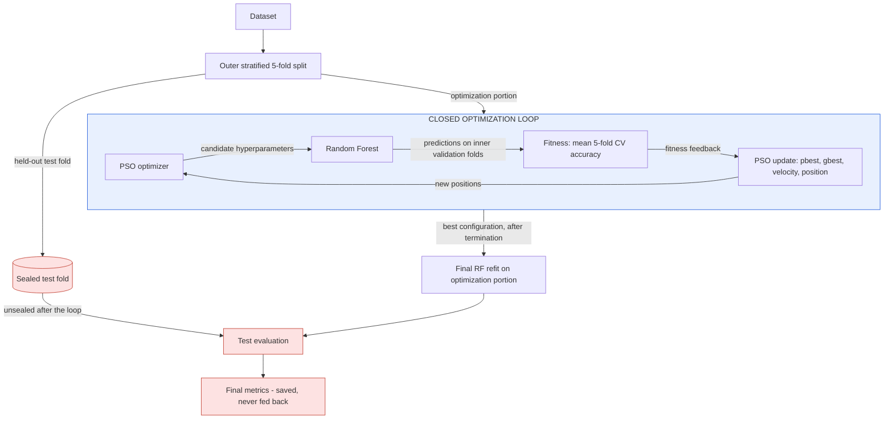
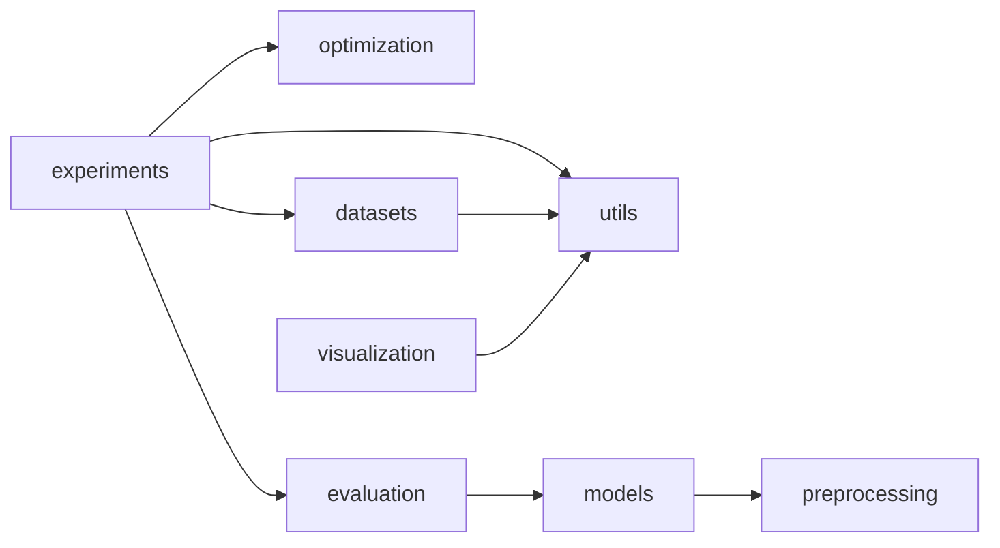

# ARCHITECTURE — PSO-Based Random Forest Hyperparameter Optimization

The architecture has one governing rule: **the closed optimization loop and the final test evaluation are two
different paths that never share data or feedback.**

Sections:
A. High-level architecture ·
B. Component architecture ·
C. Closed-loop control architecture ·
D. Data flow ·
E. PSO loop ·
F. Train/validation/test isolation ·
G. Experiment orchestration ·
H. Configuration management ·
I. Logging and results ·
J. Visualization ·
K. Error handling ·
L. Reproducibility ·
M. Extension points

---

## A. High-level architecture

```
                 ┌───────────────────────┐
                 │       Dataset         │   Iris / Digits / Heart (Cleveland)
                 └───────────┬───────────┘
                             ↓
                 ┌───────────────────────┐
                 │ Outer 5-fold split    │   StratifiedKFold(5, seed 42) — fold k is the test fold of run k
                 └─────┬─────────────┬───┘
                       │             │
      optimization portion (80%)     held-out test fold (20%)  ══╗  sealed during the loop
                       ↓                                          ║
  ┌──────────────────── CLOSED OPTIMIZATION LOOP ─────────────┐  ║
  │                 ┌────────────────┐                         │  ║
  │   ┌───────────▶ │  PSO Optimizer │                         │  ║
  │   │             └───────┬────────┘                         │  ║
  │   │                     ↓                                  │  ║
  │   │           Candidate Hyperparameters                    │  ║
  │   │        [n_estimators, max_depth, min_samples_split]    │  ║
  │   │                     ↓                                  │  ║
  │   │           ┌──────────────────┐                         │  ║
  │   │           │  Random Forest   │  trained on 4/5 of the  │  ║
  │   │           │      Model       │  optimization portion   │  ║
  │   │           └────────┬─────────┘                         │  ║
  │   │                    ↓                                   │  ║
  │   │             Validation Data  (remaining 1/5; × 5 folds)│  ║
  │   │                    ↓                                   │  ║
  │   │           ┌──────────────────┐                         │  ║
  │   │           │ Fitness Function │  mean 5-fold accuracy   │  ║
  │   │           └────────┬─────────┘                         │  ║
  │   │                    ↓                                   │  ║
  │   │                Fitness  (feedback signal)              │  ║
  │   │                    │                                   │  ║
  │   │                    └───────────────┐                   │  ║
  │   │                                    ↓                   │  ║
  │   │                           ┌────────────────┐           │  ║
  │   │                           │  PSO Update    │           │  ║
  │   │                           │ pbest / gbest  │           │  ║
  │   │                           │ velocity       │           │  ║
  │   │                           │ position       │           │  ║
  │   │                           └───────┬────────┘           │  ║
  │   └───────────── next iteration ◀─────┘                    │  ║
  │        (repeat for T = 20 iterations × N = 10 particles)   │  ║
  └──────────────────────────┬─────────────────────────────────┘  ║
                             │ loop terminated → best configuration frozen
                             ↓                                    ║
  ═════════════════ FINAL EVALUATION (open path, once) ═══════════╝
                             ↓
                  Best Hyperparameters
                             ↓
                  Final Random Forest  (refit on the whole optimization portion)
                             ↓
                  Held-Out Test Fold   (unsealed only now)
                             ↓
                  Final Metrics  → saved to disk; NEVER fed back
```

Mermaid version (renders on GitHub):



## B. Component architecture

```
src/pso_rf/
 ├─ datasets/        load · checksum · audit          ─┐
 ├─ preprocessing/   imputer spec                       │  "system side" (knows ML, never knows PSO)
 ├─ models/          RF pipeline builder · baseline     │
 ├─ evaluation/      splits+test guard · fitness+cache ─┘
 │                   · final_evaluate · metrics
 ├─ optimization/    SearchSpace · PSOOptimizer ·       ── "optimizer side" (knows only numbers)
 │                   RandomSearch · events
 ├─ experiments/     config · seeding · recorder ·      ── the ONLY place both sides meet: wires the loop
 │                   runner · CLI
 ├─ visualization/   plots from result files            ── reads files, trains nothing
 └─ utils/           hashing · io · manifest · logging
```

**Dependency direction** (arrows mean "imports"):



The `optimization` package has no import path to `evaluation`, `models`, `datasets` or scikit-learn. This is enforced
by test UT-22, which parses imports, and it is how the brief's "PSO contains no dataset-specific logic" rule is made
checkable.

| Component | Key responsibility | Knows about |
|---|---|---|
| `SearchSpace` | bounds, `decode`, `clip`, `sample` | parameter names and integer ranges |
| `PSOOptimizer` | swarm state, update equations, pbest/gbest, stopping, event emission | `SearchSpace`, an `Objective` callable, its own RNG |
| `RandomSearch` | i.i.d. uniform sampling, best selection | `SearchSpace`, `Objective`, RNG |
| `FitnessEvaluator` | fixed inner folds, pipeline building, CV scoring, cache, failure handling | `OptimizationData` only |
| `HeldOutTestSet` | holds the test arrays; `reveal()` refuses inside `OptimizationPhase` | its own arrays |
| `final_evaluate` | refit on `OptimizationData`, predict the test set, compute metrics | both, but runs only after the loop |
| `Recorder` | receives events and writes CSV/JSON rows | the event types and paths |
| `Runner` | builds folds, evaluators and optimizers; opens and closes `OptimizationPhase`; calls `final_evaluate`; saves | everything |

## C. Closed-loop control architecture

### C.1 Mapping PSO to control concepts

| Control concept | This project | Where in code |
|---|---|---|
| Plant / system | the RF training-and-validation process on $\mathcal{D}^{(k)}_{opt}$ | `FitnessEvaluator` + RF pipeline |
| Controller / optimizer | PSO | `PSOOptimizer` |
| Control variables / action | particle positions, decoded to configurations | `SearchSpace.decode` |
| Manipulated parameters | `n_estimators`, `max_depth`, `min_samples_split` of the RF | RF pipeline constructor arguments |
| Measurement | 5-fold CV accuracy on the optimization portion | `cross_validate` inside the evaluator |
| Feedback signal | `Evaluation.fitness` returned to the optimizer | `Objective` return value |
| Controller adaptation | pbest/gbest memory, velocity and position update | `PSOOptimizer._update` |
| Objective | maximize fitness | — |
| One feedback cycle | propose one configuration → measure → return its fitness | one `objective(config)` call |
| One control step (iteration) | evaluate all N particles, update memory, move all particles | one loop pass in `PSOOptimizer.run` |
| Next iteration | the moved positions become the new control actions | — |
| Loop termination | `max_iter` (or the optional patience rule) | stopping predicate |
| Open-loop reference | random search: same plant and measurement, but actions ignore feedback | `RandomSearch` |

### C.2 Where the analogy stops

1. **Static plant.** The plant has no internal state, dynamics or delay. $F_k(\theta)$ is a fixed, deterministic
   function within a run. Control theory's stability and transient concepts do not apply; convergence here means the
   swarm's best stops improving.
2. **No setpoint.** The loop maximizes a quantity rather than tracking a reference. It is closest to
   *extremum-seeking* control.
3. **The feedback is used through memory.** PSO does not react to the latest measurement alone. It uses the best
   measurements so far (pbest, gbest).
4. **The controller is stochastic** (through $r_1$, $r_2$), but reproducible for a given seed.

The faculty definition (optimizer output changes a system parameter → the system responds → the response is fed back
to the optimizer → the next output depends on it) is met exactly. The random-search comparator makes the role of
feedback **measurable** rather than asserted.

### C.3 Sequence of one iteration

```mermaid
sequenceDiagram
    participant R as Runner
    participant P as PSOOptimizer
    participant S as SearchSpace
    participant E as FitnessEvaluator
    participant RF as RF pipeline (×5 inner folds)
    participant Rec as Recorder
    loop for each particle i = 1..N
        P->>S: decode(x_i)
        S-->>P: config_i (integers)
        P->>E: objective(config_i)
        alt cache miss
            E->>RF: fit on 4 folds / score on 1 fold, ×5 (parallel)
            RF-->>E: 5 accuracies
        else cache hit
            E-->>E: reuse stored result
        end
        E-->>P: Evaluation(fitness_i, info)
        P->>Rec: on_evaluation(event_i)
    end
    P->>P: update pbest_i (strict >), gbest
    P->>P: v ← clip(w v + c1 r1 (p−x) + c2 r2 (g−x)); x ← x + v; absorbing wall
    P->>Rec: on_iteration_end(summary_t)
    Note over P: new positions → next iteration's candidates (feedback closed)
```

## D. Data flow

```
DatasetBundle (X, y, meta)
   │ outer_folds(seed=42)
   ├──▶ OptimizationData_k (X_opt, y_opt, idx) ──▶ FitnessEvaluator_k ──▶ FitnessResult ──▶ Evaluation.fitness ──▶ PSO
   │                                        └────────────────────────▶ final_evaluate (refit) ─┐
   └──▶ HeldOutTestSet_k (sealed) ─────────────────────────────────────▶ final_evaluate (predict)┴─▶ FinalMetrics_k ──▶ disk
```

| Data object | Produced by | Consumed by | Contains test rows? |
|---|---|---|---|
| `DatasetBundle` | `load_dataset` | `outer_folds`, audit | yes (full dataset) |
| `OptimizationData_k` | `outer_folds` | `FitnessEvaluator_k`, `final_evaluate` | **no** |
| `HeldOutTestSet_k` | `outer_folds` | `final_evaluate` only | yes (only these) |
| `FitnessResult` / `Evaluation` | `FitnessEvaluator` | optimizer, recorder | no |
| `OptimizationResult` | optimizer | runner | no |
| `FinalMetrics_k` | `final_evaluate` | recorder, summary | derived from test; never read by an optimizer |

## E. PSO loop

```
t = 0 : initialize X ~ U(l,u), V ~ U(±0.1·range)
        evaluate all → P = X, Pf = F, g = argmax
t = 1..20 :
   ① velocity   V = clip(wV + c1R1(P−X) + c2R2(g−X), ±v_max)
   ② position   X = X + V
   ③ bounds     absorbing wall (clip X, zero V where clipped)
   ④ decode     config_i = clip(rint(X_i))
   ⑤ evaluate   F_i = objective(config_i)      ← closed-loop feedback
   ⑥ pbest      if F_i > Pf_i: P_i = X_i
   ⑦ gbest      if max Pf > gf: g = P_argmax
   ⑧ record     iteration summary; optional patience check
stop: t = 20 (default) → return dec(g), gf, history
```

The ordering follows PDF slides 9 and 10 (evaluate → pbest → gbest → velocity → position → bounds → repeat). The only
change is presentational: step ⑤ of iteration *t* is the "evaluate" of the next pass through the PDF cycle.

## F. Train/validation/test isolation

### F.1 Trust boundary

```
╔══════════════════════════════════ OPTIMIZATION PHASE (context manager) ═════════════════════════════════╗
║  OptimizationData_k ──▶ FitnessEvaluator_k ──▶ inner folds Q1..Q5 (train 4 / validate 1)                ║
║  PSOOptimizer / RandomSearch  ◀── fitness only                                                          ║
║  HeldOutTestSet_k.reveal()  →  raises TestSetAccessError                                                ║
╚═════════════════════════════════════════════════════════════════════════════════════════════════════════╝
                                    │ exit: best configuration frozen (immutable)
                                    ▼
┌──────────────────────────────── FINAL EVALUATION (outside the phase) ──────────────────────────────────┐
│  final_evaluate(best_config, OptimizationData_k, HeldOutTestSet_k) → reveal() allowed → metrics → disk  │
└─────────────────────────────────────────────────────────────────────────────────────────────────────────┘
```

### F.2 Defence in depth

| Layer | Mechanism | Test |
|---|---|---|
| Structural | the optimizer's constructor takes no data; the evaluator's constructor type-checks and rejects a `HeldOutTestSet` | UT-22, IT-05 |
| Runtime guard | `HeldOutTestSet.reveal()` raises inside `OptimizationPhase` | UT-15 |
| Index | the outer fold indices are disjoint and cover all rows | UT-14, IT-04 |
| Behavioural | permuting `y_test` or replacing `X_test` with noise leaves the optimization trajectory bit-identical | IT-06, IT-07 |
| Observational | a spy on `fit`/`predict` inputs during optimization finds no test-row hash | IT-05 |
| Preprocessing | imputation lives inside the pipeline, so it is refit on each training part only | UT-20, IT-11 |
| Temporal | the log shows each test evaluation happening after optimization ends | ET-04 |

## G. Experiment orchestration

```
run_experiment(cfg)
 ├─ resolve config → exp_id → results/<exp_id>/ ; write config.resolved.json, manifest.json
 ├─ for dataset in cfg.datasets:                          (config order)
 │    ├─ bundle = load_dataset(); audit → metric (class-ratio gate)
 │    ├─ folds = outer_folds(bundle, 5, seed=42)
 │    ├─ for k in 0..4:                                    (seed s_k = run_seeds[k] = k)
 │    │    ├─ evaluator_k = FitnessEvaluator(folds[k].opt, cv=5, seed=s_k, metric, preprocessing)
 │    │    ├─ method baseline:       with OptimizationPhase: cv score of θ0      → final_evaluate → save
 │    │    ├─ method random_search:  with OptimizationPhase: RandomSearch(210)    → final_evaluate → save
 │    │    └─ method pso:            with OptimizationPhase: PSOOptimizer(10,20)  → final_evaluate → save
 │    │       (each method gets a fresh cache: the three methods share the evaluator class but not results)
 │    └─ deployment: PSO on the full dataset, seed 5 → deployment.json (no test)
 ├─ aggregate summary_folds.csv, summary.csv from saved files
 └─ return results/<exp_id>/
```

**Why a fresh cache per method.** Sharing a cache between random search and PSO would let one method benefit from the
other's evaluations. The reported `n_unique_fits` would then no longer describe that method's own cost.

**Execution model.** Runs are sequential; inside each evaluation the 5 inner folds run in parallel with joblib's
default loky backend. The CLI entry point sits under `if __name__ == "__main__":`, which Windows process spawning
requires.

**CLI (planned):**

```
python -m pso_rf run   --config configs/default.yaml [--set pso.max_iter=30] [--datasets iris] [--folds 0]
python -m pso_rf plot  --results results/<exp_id>
python -m pso_rf audit --datasets all          # dataset audit only
```

## H. Configuration management

**Layering.** `configs/default.yaml` ← experiment file (e.g. `configs/demo.yaml`) ← `datasets.<name>` block for that
dataset ← CLI `--set`. Each layer deep-merges into the previous one. The result is validated into frozen dataclasses
and saved as `config.resolved.json`, and its SHA-256 goes into the manifest.

PSO parameters can therefore be shared globally (the top-level `pso:` block) or overridden per dataset
(`datasets.digits.pso.max_iter: 30`). This supports both the brief's option A (shared) and option B (per-dataset).
The default experiment uses **shared** parameters for all datasets.

**`configs/default.yaml` template:**

```yaml
experiment:
  name: default
  datasets: [iris, digits, heart_cleveland]
  methods: [baseline, random_search, pso]
  deployment_run: true
  results_dir: results
  plots_dir: plots
  data_dir: data

split:
  outer_folds: 5
  outer_seed: 42
  inner_folds: 5
  run_seeds: [0, 1, 2, 3, 4]      # seed for outer fold k
  deployment_seed: 5

fitness:
  metric: accuracy                # accuracy | balanced_accuracy
  class_ratio_gate: 1.5           # switch to balanced_accuracy above this max/min class ratio
  diagnostics: [balanced_accuracy, f1_macro]
  cache: true
  n_jobs_folds: 5

search_space:
  n_estimators:      {low: 50, high: 200}
  max_depth:         {low: 2,  high: 20}
  min_samples_split: {low: 2,  high: 10}

pso:
  n_particles: 10
  max_iter: 20
  w: 0.7298
  c1: 1.49618
  c2: 1.49618
  v_max_frac: 0.2                 # v_max = frac × (high − low)
  v_init_frac: 0.1                # initial velocity ~ U(±frac × range)
  boundary: absorb                # absorb (default) | reflect (extension)
  topology: gbest
  update: synchronous
  patience: {enabled: false, tol: 1.0e-4, iterations: 5}

random_search:
  budget: auto                    # auto = n_particles × (max_iter + 1) = 210

random_forest:
  n_jobs: 1                       # all other params = sklearn defaults

baseline:
  params: {}                      # {} = RandomForestClassifier() defaults

datasets:
  iris: {}
  digits: {}
  heart_cleveland:
    preprocessing: {impute: most_frequent}
```

## I. Logging and results

- The **Recorder** callback writes `evaluations.csv` rows as evaluations happen (flushing each iteration, so a crashed
  run keeps its history) and `iterations.csv` rows at each iteration end.
- `final.json` and `predictions.csv` are written after `final_evaluate`. `summary*.csv` is written at the end of the
  experiment.
- Console (INFO): one line per iteration, e.g.
  `[iris|fold 0|pso|seed 0] iter 7/20  gbest (187,9,3)=<fitness>  mean=<…>  unique fits 58`.
- `run.log` (DEBUG): every evaluation, cache hits, timings and warnings.
- The schema is in [RESULTS_SCHEMA.md](RESULTS_SCHEMA.md).

## J. Visualization

- `pso_rf.visualization` reads **only** result files and trains no models.
- Each figure is recorded in `plots/<exp_id>/SOURCES.json` with the CSV/JSON paths and the config hash it came from.
- Figures planned (details in [EXPERIMENT_PLAN.md](EXPERIMENT_PLAN.md) §9):
  - the architecture and closed-loop diagrams (static, from this document);
  - convergence curves;
  - the anytime curve (PSO vs. random search);
  - baseline vs. random search vs. PSO test accuracy;
  - hyperparameter trajectories;
  - particle fitness progression;
  - gbest configuration evolution;
  - dataset-wise deltas;
  - pooled confusion matrices.

## K. Error handling

| Situation | Handling |
|---|---|
| Position outside bounds | cannot reach the evaluator: the absorbing wall and `decode` clip guarantee valid integers |
| Invalid config (bad bounds, wrong types, seed-count mismatch) | fail fast at load with a clear message; nothing runs |
| RF fit or score raises | caught in the evaluator: `status="failed"`, `error=<message>`, `fitness=-inf`, logged at WARNING, run continues. A configuration that fails is never chosen as best unless all fail, in which case the run aborts with an error. |
| NaN score | treated as a failure (`-inf`) |
| Test data accessed during optimization | `TestSetAccessError` aborts the run. This is a bug, never a recoverable event. |
| Dataset checksum mismatch | abort with the expected and actual SHA-256 |
| Missing Cleveland file | abort with the command to run the download script |
| Interrupted run | partial `evaluations.csv` is kept; a re-run starts that run from scratch (no resume, to keep runs atomic and reproducible) |

## L. Reproducibility

- The seeds are listed in [CONTEXT.md](CONTEXT.md) §17: outer 42, run seed *k* for fold *k*, deployment 5.
- There is one `np.random.Generator` per optimizer and no global random state.
- Inner folds are fixed per run, and RF `random_state` is set on every fit.
- The manifest records the git SHA, a dirty flag, library versions, platform, CPU count, dataset SHA-256s and the
  config hash.
- Acceptance: re-running the same config reproduces `evaluations.csv`, `iterations.csv`, `final.json` and
  `summary*.csv` exactly, excluding timestamps and timing fields (IT-08).

## M. Extension points

| Extension | Where it plugs in | Core change needed |
|---|---|---|
| New dataset | add a loader to the `datasets` registry, plus an optional `datasets.<name>` config block | none |
| New hyperparameter (e.g. `max_features`) | add an entry to `search_space` and map it in the RF builder | none in PSO (dimension is inferred from `SearchSpace`) |
| Categorical hyperparameter | a new `CategoricalParam` with an index encoding in `SearchSpace.decode` | small, in `SearchSpace` only |
| Other fitness metric | `fitness.metric` (any scikit-learn scorer name) | none |
| Other PSO variants (decreasing w, ring topology, reflect boundary) | `pso.*` config switches, implemented in `PSOOptimizer` | local |
| Another optimizer (GA, Bayesian) as a comparator | implement `run(callbacks) -> OptimizationResult` against the same `Objective` | none in the evaluator or runner |
| Parallel particle evaluation | a batch objective `objective_batch(list[config])` in the evaluator | the evaluator plus a PSO option; must preserve determinism |
| Multi-objective (accuracy vs. size) | the `Evaluation.info` carries secondary objectives | a new optimizer variant |
