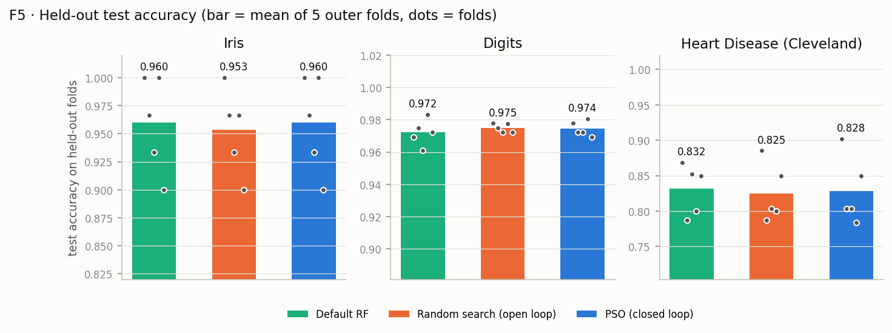
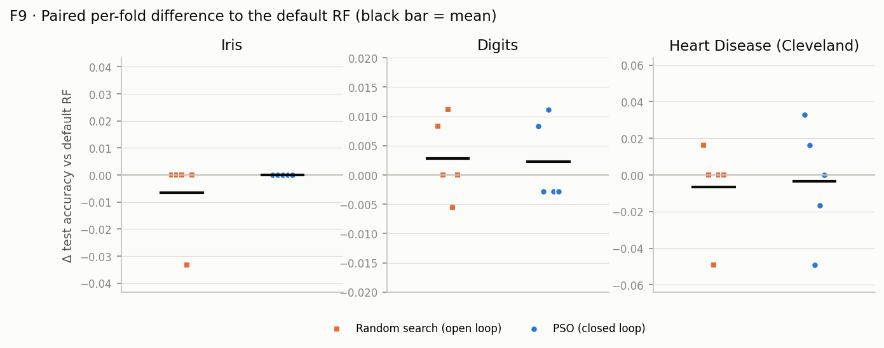
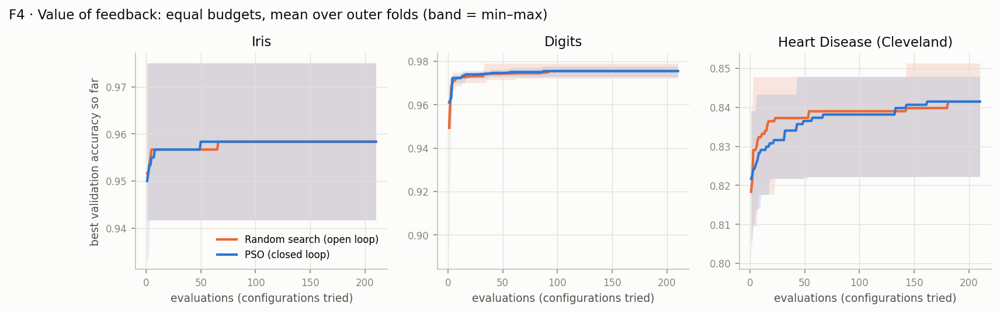
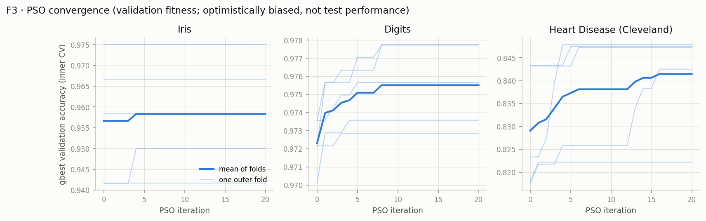

# PSO-Based Random Forest Hyperparameter Optimization — Results Report

Anush Ramesh (CB.EN.U4ELC23005) · EEE, Amrita Vishwa Vidyapeetham, Coimbatore · Evolutionary Optimization
mini-project.

**Experiment:** `results/20260925-083324_default` (commit `8bd5927`, clean tree, `python -m pso_rf verify`:
all checks pass).

**Sources:** every number below is read from that directory. The tables are generated by
`scripts/report_tables.py` into [tables.md](tables.md), and the figures come from
`plots/20260925-083324_default/` (with `SOURCES.json`).

---

## 1. What was run

A closed optimization loop: **PSO** proposes Random Forest hyperparameters $x = [n\_estimators, max\_depth,
min\_samples\_split]$ within 50–200, 2–20 and 2–10. A forest is trained, its mean **5-fold inner-CV accuracy** is
fed back as fitness, and PSO updates pbest, gbest, velocities and positions. N = 10 particles run for T = 20
iterations, giving 210 evaluations, with $w = 0.7298$ and $c_1 = c_2 = 1.49618$.

Each of the three datasets was split into **5 stratified outer folds**. In run *k*, fold *k* is sealed as the
held-out test set and three methods are applied to the remaining 80%:
- **Default RF:** scikit-learn defaults, no tuning.
- **Random search:** 210 uniform configurations with **no feedback**, the open-loop control.
- **PSO:** 210 evaluations, closed loop.

Each chosen configuration is refit and scored **once** on the test fold, so every sample is tested exactly once
per method. Code-level isolation is proven by tests (IT-04 to IT-07, UT-15, ET-04). The run log confirms that no
test data was revealed during any optimization phase.

## 2. Datasets (T1)

| Dataset | Samples | Features | Classes | Class counts | Missing cells |
|---|---|---|---|---|---|
| Iris | 150 | 4 | 3 | 50 / 50 / 50 | 0 |
| Digits | 1797 | 64 | 10 | 174–183 per class | 0 |
| Heart Disease (UCI Cleveland) | 303 | 13 | 2 | 164 / 139 | 6 (imputed inside each fit) |

## 3. Main results (T2, source `summary.csv`)

| Dataset | Default RF | Random search | PSO | PSO Δ vs default | PSO W/T/L vs default | PSO W/T/L vs random search |
|---|---|---|---|---|---|---|
| Iris | 0.9600 ± 0.0435 | 0.9533 ± 0.0380 | 0.9600 ± 0.0435 | +0.0000 | 0/5/0 | 1/4/0 |
| Digits | 0.9722 ± 0.0081 | 0.9750 ± 0.0028 | 0.9744 ± 0.0046 | +0.0022 ± 0.0069 | 2/0/3 | 1/2/2 |
| Heart Disease | 0.8316 ± 0.0359 | 0.8251 ± 0.0412 | 0.8283 ± 0.0478 | −0.0033 ± 0.0316 | 2/1/2 | 2/2/1 |

Values are held-out **test accuracy**, the mean ± sd over 5 outer folds. The full table, with macro F1 and
validation scores, is T2 in [tables.md](tables.md).

## 4. Answers to the research questions

**RQ1 — Does PSO improve or maintain test performance relative to the default RF? It maintains it; it does not
clearly improve it.**
- Iris: PSO ties the default on all five folds.
- Digits: the mean difference is +0.0022 (2 wins, 3 losses).
- Heart Disease: the mean difference is −0.0033 (2 wins, 1 tie, 2 losses).

Every difference is smaller than the fold-to-fold spread. It also stays within about one or two test samples per
fold: one Iris test sample is worth 0.033, and one Heart sample about 0.016. The proposal's expected outcome
("improve **or maintain**") is met on the *maintain* side. The default Random Forest is already a strong
configuration for these three datasets.

**RQ2 — Does PSO's feedback help, compared with the same budget spent without feedback? Not measurably, on this
search space.**
- Validation fitness at the end of the budget is essentially equal: 0.9583 vs 0.9583 on Iris, 0.9755 vs 0.9755
  on Digits, and 0.8415 vs 0.8414 on Heart.
- The fold-level test comparison splits both ways (T2).
- The anytime curves (F4) show random search reaching good configurations as fast as PSO early on Heart Disease,
  with PSO catching up by the end.

This is a null result, and it is reported as one. With only three integer variables and a flat landscape (on Iris, 37 to 188 distinct configurations
tie with the best validation score in a single run; T3), 210 uniform samples already cover the good region well.
Feedback has little to exploit.

The one measurable benefit of the closed loop was **cost**. As the swarm converges it revisits configurations it
has already evaluated, and the cache answers them. PSO needed **188.8 / 159.0 / 164.2** unique Random Forest fits
on average (Iris / Digits / Heart), against **209.6** for random search: 10–24% fewer model trainings for the same
210-evaluation budget.

**RQ3 — How does the search converge?**
- **Digits:** gbest improved until iterations 3–8 (T3), then plateaued.
- **Heart Disease:** it kept finding improvements longer (convergence iterations 1, 6, 16, 5 and 4).
- **Iris:** the best configuration was already in the initial swarm on 4 of 5 folds (convergence iteration 0).

Swarm diversity (F11) falls as the particles contract onto gbest, which is the expected shift from exploration
to exploitation.

**RQ4 — How stable are the results?** Test accuracy varies more between folds than between methods (sd 0.036–0.048
on Iris and Heart Disease). The chosen configurations differ from fold to fold (T3). That is evidence of flat landscapes,
not instability of PSO: on Iris, **37 to 188 distinct configurations tie** with the best validation score in a
single run. The reported "best" configuration is therefore one of many equally good ones.

**RQ5 — How do the datasets differ?**
- **Digits:** favors deep trees (max_depth 9–19 in every PSO run).
- **Heart Disease:** favors shallow trees (max_depth 2–6 in 4 of 5 runs), which regularizes a small, noisy
  clinical dataset.
- **Iris:** too easy for the hyperparameters to matter.

The deployment runs recommend the following configurations (T5); each performance estimate is the outer-CV mean
of the same procedure:

| Dataset | Recommended configuration | Estimated test accuracy |
|---|---|---|
| Iris | (171, 17, 6) | 0.9600 ± 0.0435 |
| Digits | (178, 18, 3) | 0.9744 ± 0.0046 |
| Heart Disease | (110, 3, 4) | 0.8283 ± 0.0478 |

## 5. Validation fitness is optimistic, so only test accuracy is performance

On Heart Disease, PSO's best validation accuracy averaged **0.8415**, but its test accuracy was **0.8283**. The
default RF's validation accuracy was **0.8126** and its test accuracy **0.8316**. Picking the maximum of 210 noisy
estimates overstates how good the winner is (the winner's curse). This is why the protocol never reports
validation fitness as performance, and why the held-out test folds exist.

## 6. Limitations

- Test folds are small on Iris (30 samples) and Heart Disease (about 61). With 5 paired folds no significance
  test is possible: the minimum two-sided Wilcoxon p-value is 0.0625. The results above are descriptive only.
- Only three hyperparameters were tuned, as the proposal specified. `max_features`, often the most influential
  Random Forest knob, is left at its default. A richer search space is where feedback would be expected to
  matter more.
- Runtime: the full experiment took **62.7 min**, against a projected upper bound of 37.5 min from the Phase 6
  timing gate. The measured median time per evaluation was about 2.7× the short benchmark's estimate: 0.354 s vs
  0.128 s on Iris, and 1.00 s vs 0.33 s on Digits. The overrun is recorded in DECISIONS.md ADR-005 and CONTEXT §4.
  It does not affect any result.

## 7. Reproducibility

- Seeds: outer split 42; run *k* uses seed *k*; the deployment run uses seed 5.
- `config.resolved.json` and `manifest.json` record the configuration hash, commit, library versions and dataset
  checksums.
- An Iris-only re-run with the same configuration was compared file by file with `python -m pso_rf compare`,
  ignoring timing fields; the result is in section 8.
- The test suite has 190 tests, including the isolation and closed-loop proofs.

## 8. Reproducibility check

The Iris part of the experiment was re-run from scratch with the same configuration (all 5 folds × 3 methods,
plus the deployment run). `python -m pso_rf compare results/20260925-083324_default/iris <re-run>/iris` reports
**identical (excluding timing fields)**: every evaluation row, iteration row, chosen configuration, prediction and
test metric matches exactly. The same property is checked on a small scale by the test suite (IT-08).

## 9. Figure index

- F3: convergence
- F4: anytime curves, PSO vs random search
- F5: test accuracy
- F6: particle trajectories
- F7: particle fitness
- F8: gbest evolution
- F9: paired deltas
- F10: pooled confusion matrices
- F11: swarm diversity

All are in `plots/20260925-083324_default/`. The interactive demo (`python -m pso_rf demo`) shows the same
results, plus a live run of the closed loop.
